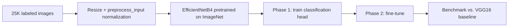

# Deep Learning: Network Depth Theory & Transfer Learning

**Python, PyTorch, TensorFlow/Keras, EfficientNetB4**

Two independent deep-learning studies:

1. **Why depth helps** — an independent replication of a landmark theoretical
   result, showing deep networks fit a compositional function far more
   efficiently than shallow ones at matched neuron budgets.
2. **Transfer learning for image classification** — EfficientNetB4 adapted to
   a binary cats-vs-dogs classification task via two-phase fine-tuning,
   benchmarked against a VGG16 baseline.

## Part 1: Shallow vs. Deep Networks

Replicates the core empirical finding of Mhaskar, Liao & Poggio (2017),
["When and Why Are Deep Networks Better Than Shallow Ones?"](https://ojs.aaai.org/index.php/AAAI/article/view/10913)
(AAAI) — for a compositional target function, deeper networks reach lower
test error than shallow networks at an equivalent neuron budget.

**Target function:** f(x) = 2(2cos²(x) − 1)² − 1, x ~ Uniform[−2π, 2π] — a
composition of simple functions, exactly the structure deep networks are
theoretically suited to exploit: each layer computes one stage of the
composition, while a shallow network must approximate the whole thing with a
single hidden layer of basis functions.

120,000 samples generated, split 60,000/60,000 train/test. Three
architectures compared (1, 2, and 3 hidden layers), each trained with SGD
(momentum=0.9, lr=1e-3, 150 epochs, 2 repeats per configuration), best test
RMSE reported.

**Run it:** `python src/run_shallow_vs_deep.py` (implemented in PyTorch,
runs on CPU or Apple Silicon MPS in a couple of minutes — no external data
needed).

### Results (this run)

| Architecture | Neurons/layer | Best Test RMSE |
|---|---|---|
| 1 hidden layer | 8 – 48 | 0.688 – 0.702 |
| 2 hidden layers | 8 – 24 | 0.645 – 0.664 |
| **3 hidden layers** | 6 – 18 | **0.380 – 0.569** |

The 3-hidden-layer network reaches RMSE ≈ 0.38 with only 12 neurons per
layer — well below what the 1-hidden-layer network achieves even at 48
neurons per layer. Depth, not just parameter count, is what lets the network
exploit the function's compositional structure.

## Part 2: Transfer Learning for Image Classification

A binary image classifier (cat vs. dog) built on the [Dogs vs. Cats Redux:
Kernels Edition](https://www.kaggle.com/c/dogs-vs-cats-redux-kernels-edition)
dataset (25,000 labeled training images, 12,500 test images), comparing two
EfficientNetB4 configurations against a VGG16 baseline.

**Note on reproducibility:** this part was trained on Google Colab (GPU T4)
against Kaggle's dataset (~800MB, requires a Kaggle account to download).
The notebooks in `notebooks/02` and `notebooks/03` contain the exact code
used, cell markdown documents the methodology, and the results below are as
achieved in that run — they are not re-executed as part of this repository
(no GPU training pipeline runs automatically here). Part 1 above, by
contrast, is fully self-contained and re-executable with no external data.

### Methodology



- **Preprocessing:** images resized (224px / 260px), organized into class
  subfolders for `flow_from_directory`, normalized with EfficientNetB4's
  `preprocess_input` (channel-wise mean subtraction, not simple rescaling).
- **Model:** EfficientNetB4 pretrained on ImageNet, custom classification
  head (`GlobalAveragePooling2D → Dense(256, relu) → Dropout(0.5) →
  Dense(1, sigmoid)`).
- **Two-phase training:** Phase 1 trains only the classification head with
  the backbone frozen (lr=1e-3); Phase 2 unfreezes the top 30–100 backbone
  layers and fine-tunes at a much lower learning rate (1e-5).
- **Augmentation:** horizontal/vertical flip, rotation (±20°), zoom (±20%),
  brightness (0.8–1.2), applied to training data only.
- **Overfitting control:** 20% validation split, Dropout(0.5), EarlyStopping
  (patience 4–5), ReduceLROnPlateau, ModelCheckpoint on best weights.
- **Baseline comparison:** VGG16 with a fully frozen backbone, to isolate
  the benefit of EfficientNetB4's compound scaling + selective fine-tuning.

### Results

| Model | Image size | Fine-tuned layers | Validation accuracy | Kaggle log loss |
|---|---|---|---|---|
| VGG16 (frozen backbone) | 224px | 0 | 98.48% | — |
| EfficientNetB4 (v1) | 224px | top 30 | — | 0.08464 |
| **EfficientNetB4 (v2)** | **260px** | **top 100** | **99.34%** | **0.07871** |

Increasing image resolution (224→260px) and unfreezing more backbone layers
(30→100) improved both validation accuracy and Kaggle log loss, confirming
that selective fine-tuning captures task-specific visual features that a
fully frozen pretrained backbone misses.

## Repo structure

```
deep-learning-image-classification/
├── notebooks/
│   ├── 01_shallow_vs_deep.ipynb              re-executable, no external data
│   ├── 02_efficientnet_v1_224px.ipynb        EfficientNetB4 @ 224px, 30 layers unfrozen
│   └── 03_efficientnet_v2_260px_finetuned.ipynb  EfficientNetB4 @ 260px, 100 layers unfrozen (best)
├── src/
│   ├── shallow_vs_deep.py                    PyTorch implementation, Part 1
│   └── run_shallow_vs_deep.py                runs the full experiment, saves plot + results
├── outputs/
│   ├── shallow_vs_deep_comparison.png
│   └── shallow_vs_deep_results.json
└── requirements.txt
```

## Setup

```bash
pip install -r requirements.txt
python src/run_shallow_vs_deep.py   # Part 1 — self-contained, ~2 minutes
```

Part 2 (`notebooks/02`, `notebooks/03`) requires a Kaggle account, the
`dogs-vs-cats-redux-kernels-edition` competition data, and a GPU runtime
(the notebooks are written for Google Colab and prompt for a `kaggle.json`
API token on first run).

## Limitations

- Part 1 uses a specific compositional target function and a limited
  architecture search (5/3/3 neuron configurations); it demonstrates the
  qualitative effect from the source paper, not an exhaustive study.
- Part 2's results are as achieved on a single Colab GPU training run; no
  claim is made about variance across repeated runs, and the two Kaggle
  scores were achieved sequentially with iterative changes (resolution +
  fine-tuning depth) rather than a full controlled ablation.
- Part 2 depends on Kaggle's dataset and account access; it isn't
  runnable end-to-end from this repo without that external dependency.
